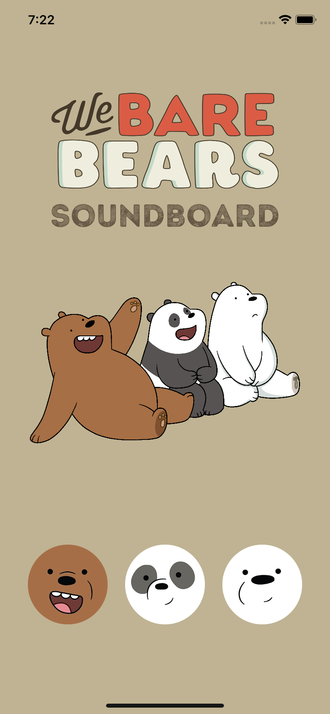

<h1 align="center">

We Bare Bears Soundboard

</h1>

## Objective
First iOS app creating a soundboard featuring characters from a show I love called We Bare Bears.
This app focuses on experimenting with the filesystem, displaying images on screen and layouts in landscape and portrait mode.

## Progress
- All constraints now working, app can now be viewed in landscape mode
- All images and buttons present on screen
- Theme song now played when clicked on main heading
- Individual soundbites added to main buttons
- Extra soundbites added, random soundbite played when button is pressed

## Improvements
Nothing!!!!

## Installation

1. Clone repository

## Screenshots

## Tech Stack
Swift

## Collaborators
@mattybwoy
